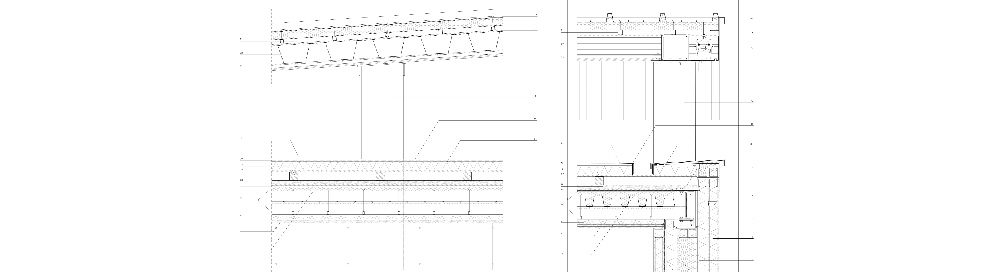

+++
author = "Ahmed Marey"
title = "1. Architecture design"
date = "2019-09-01"
description = "Academic record - Polytechnic of Milan Bachelor L-17."
tags = [
]
categories = [
    "Academic record",
    "Milan",
    "Bachelor",
]
series = ["Themes Guide"]
aliases = ["migrate-from-jekyl"]
image = "auic.jpeg"
+++

## University and Courses

The **Bachelor** of Architecture Design program at [**Politecnico di Milano**](https://www.polimi.it/) focuses on design, planning, and management of the built environment. The program aims to develop students’ technical, creative, and critical thinking skills through a combination of theoretical and practical coursework. Students learn to design sustainable and innovative buildings and spaces, incorporating cultural, social, and economic considerations. The main projects can be analyzed in the [PORTFOLIO](MRY_Portfolio.pdf).

## My career

I chose to pursue a Bachelor's degree in Architecture Design at **Politecnico di Milano** due to my deep love and passion for architecture, planning, attention to detail, and creative thinking. The program offered by Politecnico di Milano perfectly aligned with my interests and goals in the field of architecture.

One of the aspects that drew me to the field of architecture is the opportunity to create meaningful and impactful spaces that can positively influence people's lives. I have always been fascinated by the power of architecture to shape communities, evoke emotions, and contribute to the overall well-being of individuals. The ability to transform abstract ideas into tangible, functional structures and environments is something that truly inspires me.

Furthermore, my **attention to detail** and **meticulous nature** find a perfect outlet in the field of architecture. I have a strong inclination towards precision and ensuring that every aspect of a design is carefully considered and executed. From the selection of materials to the arrangement of spaces, I am driven by the pursuit of excellence and strive to create designs that are not only visually stunning but also functional and practical.

